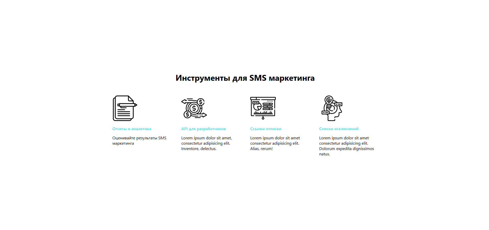
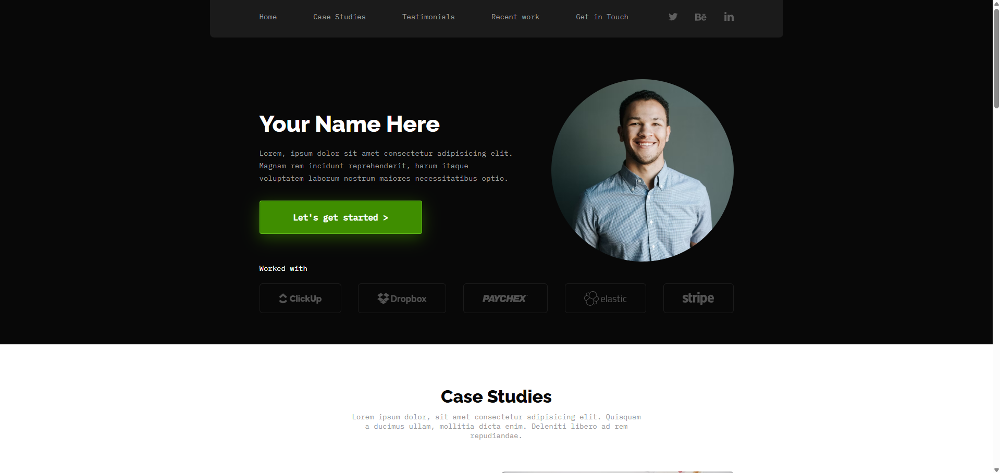

# Webka Layouts

Небольшой учебный HTML/CSS проект с тремя вариантами верстки в разных Git-ветках.

## Что в проекте

- `layout/#1` - простое модальное окно.
- `layout/#2` - блок с карточками "Инструменты для SMS маркетинга".
- `layout/#3` - лендинг-страница с адаптивной версткой.

## Превью

### Layout #2

### Layout #3

